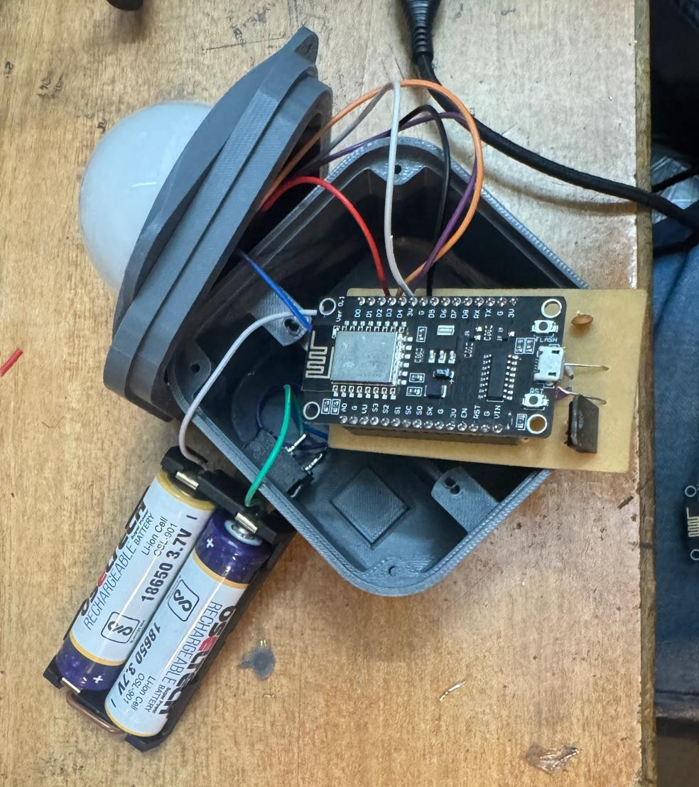

# Smart-Workplace-Optimiser
An AI-powered IoT system that detects user emotions through a webcam and dynamically adjusts lighting and music to enhance focus and productivity.

# 💡 Smart Workplace Optimiser: Emotion-Aware Productivity System

## 🧩 Overview
**Smart Workplace Optimiser** is an AI-powered IoT system designed to enhance productivity and well-being.  
It detects user emotions using a webcam and automatically adjusts ambient lighting and music to match or improve mood, creating a smart, emotionally adaptive workspace.

---

## 🎯 Objectives
- Enhance employee well-being through emotional intelligence  
- Boost focus and productivity  
- Enable adaptive work environments using AI + IoT  

---

## 🧠 Problem Statement
Modern workplaces are emotionally unaware.  
Employees face stress, reduced motivation, and burnout due to static environments that fail to respond to their emotional states.  
This project addresses this gap by integrating emotion recognition with smart automation.

---

## ⚙️ Components

### 🧰 Hardware
- ESP8266 Microcontroller  
- RGB LED  
- 7805 Voltage Regulator  
- Resistors, Capacitors  

### 💻 Software
- Python  
- OpenCV  
- DeepFace (Emotion Detection)  
- Arduino IDE  
- VS Code / Tinkercad / KiCad  

---

## 🔬 Methodology
1. **Emotion Detection:** Webcam captures user’s face in real-time using OpenCV.  
2. **Emotion Classification:** DeepFace analyzes facial expressions (happy, sad, angry, neutral).  
3. **Wireless Communication:** Detected emotion is sent via Wi-Fi (ESP8266).  
4. **Smart Environment Control:**  
   - Lighting color changes via RGB LED.  
   - Music playback is triggered based on emotion.  
5. **Continuous Monitoring:** System dynamically updates lighting and sound to match emotional shifts.

---

## 🧾 Results and Observations
- Real-time emotion recognition achieved with high accuracy.  
- Lighting and music dynamically respond to user emotions.  
- Stable communication between Python (AI) and ESP8266 (IoT).  
- Custom PCB and 3D-printed casing ensure neat and functional setup.

---

## 🔮 Future Recommendations
- Add voice tone emotion detection  
- Integrate physiological sensors (heart rate, skin conductance)  
- Mobile app for control and insights  
- Dashboard integration with productivity tools  

---

## 🧩 Conclusion
Smart Workplace Optimiser successfully combines AI and IoT to create a responsive workspace that adapts to the user’s mood.  
It promotes comfort, focus, and productivity, redefining how humans interact with their work environments.

---

## 📷 Demo / Block Diagram

